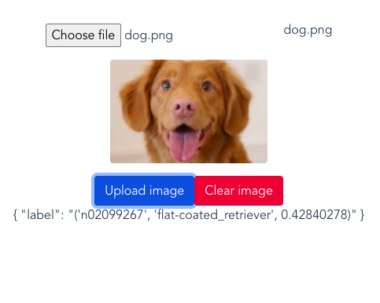

# Guide d'installation

This is a small project that uses deep neural networks + imagenet to classify a given
image into a class, it uses Vuejs and Keras for the backend, it is a prototype and has 
a lot stuff to do, feel free to PR.

This is a small result after loading a random image from google


## Download the project
```sh
$ git clone https://github.com/xdanielsb/hackcloud.git`
$ cd hackcloud`
```


## Install on your machine

### Backend

```
$ cd logic
$ pip install -r ./requirements.txt
$ pip install tensorflow
$ export FLASK_APP=api.py
$ python -m flask run
```
### Frontend
```
cd view
npm install
npm run serve
```

## Scalingo

Impossible: tensorflow is too large for our small server?

## Test

Open a page in http://localhost:8080


Also there are some unit test over there, $pytest$ 
